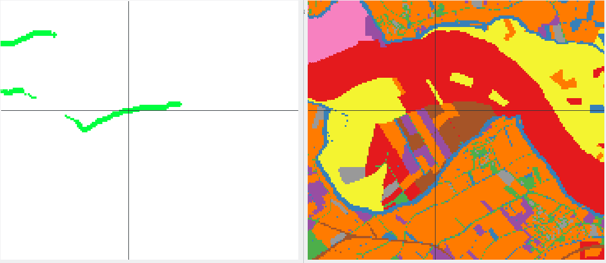

# Landowner evaluation

## Overview

Decisions for adaptation measures require an overview of stakeholders involved,
an information relevant e.g. for compensation or expropriation of landowners.
The number of landowners can therefore be seen as proxy for governance complexity.
This notebook assesses the number and types of land owners involved in the measure extent.


## How to start


First import the RiverScape and additional required Python modules to run this notebook.


``` code
import pandas
import numpy
from riverscape import *

# Visualisation
import geoviews
geoviews.extension('bokeh')
```

Evaluation is performed on a set of measures that you defined in the intervention planning notebook.
Previously, you stored a set of measures to disk.
Now choose the directory holding the measures that you want to evaluate.
Select a subdirectory of the ```maps``` folder, such as ``lowering_everywhere``:


``` code
measure_dir  = select_directory()
```


Intended measures in particular areas may affect various stakeholders, such as citizens, companies or governmental institutions.
Example is shown in the figure,
on the left potential areas of a measure are shown,
on the right an impression of the variety of ownerships.





The ownership is furthermore spread over individual owners within the area.
these owners need to participate in the decision process or considerer for imminent expropriation.
It is therefore relevant to know the number of affected stakeholders to estimate the governance complexity of a particular measure.


The following operation returns that number, calculated by an overlay of the areas affected by a measure and the landowner map.
Note that the numbers fairly give an indication about the amount of involved stakeholders.


``` code
affected = involved_stakeholders(measure_dir)
```


After formatting you will see the resulting table:


``` code
dfStyler = affected.style.set_properties(**{'text-align': 'left'})
dfStyler.hide_index()
dfStyler.set_table_styles([dict(selector='th', props=[('text-align', 'left')])])
```


Execute the next cell in case you want to store the result.
You can adapt the filename and location, default is the selected directory of measures.


``` code
path = measure_dir
filename = 'involved_owners.csv'
affected.to_csv(os.path.join(path, filename), index=False)
```
